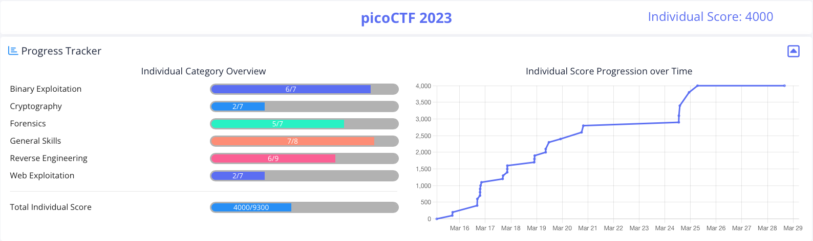

# picoCTF 2023

## Overview ##

I participated in the [picoCTF](www.picoctf.org) 2023 competition as an individual competing in the Global category, organised by [Carnegie Mellon University](https://cmu.edu/), which ran from Mar 15 2023 to Mar 29 2023. 

This is a write up of the challenges solved during the event.

## Progress ##

## Challenges ##

**This event write up is a work in progress.**

As time permits I'll be adding further individual challenge write ups for all those marked as `(Solved)`, based on my notes taken during the event. Additionally there may be the odd challenge that I failed to solve but want to document my progress, marked `(Unsolved - Progress Writeup)`.

  
Binary Exploitation (6 solutions)

* **[babygame01](Binary%20Exploitation/babygame01/babygame01.md) (Solved)**
* **[two-sum](Binary%20Exploitation/two-sum/two-sum.md) (Solved)**
* **[babygame02](Binary%20Exploitation/babygame02/babygame02.md) (Solved)**
* **[hijacking](Binary%20Exploitation/hijacking/hijacking.md) (Solved)**
* **[tic-tac](Binary%20Exploitation/tic-tac/tic-tac.md) (Solved)**
* **[VNE](Binary%20Exploitation/VNE/VNE.md) (Solved)**
* **[Horetrack](Binary%20Exploitation/Horsetrack/Horsetrack.md) (Unsolved - Progress Writeup)**

  
Cryptography (2 solutions)

* HideToSee (Unsolved)
* **[ReadMyCert](Cryptography/ReadMyCert/ReadMyCert.md) (Solved)**
* **[rotation](Cryptography/rotation/rotation.md) (Solved)**
* PowerAnalysis: Warmup (Unsolved)
* PowerAnalysis: Part 1 (Unsolved)
* SRA (Unsolved)
* PowerAnalysis: Part 2 (Unsolved)

  
Forensics (5 solutions)

* **[hideme](Forensics/hideme/hideme.md) (Solved)**
* **[PcapPoisoning](Forensics/PcapPoisoning/PcapPoisoning.md) (Solved)**
* **[who is it](Forensics/who%20is%20it/who-is-it.md) (Solved)**
* **[FindAndOpen](Forensics/FindAndOpen/FindAndOpen.md) (Solved)**
* **[MSB](Forensics/MSB/MSB.md) (Solved)**
* Invisible WORDs (Unsolved)
* UnforgottenBits (Unsolved)

  
General Skills (3 solutions)

* chrono (Solved)
* money-ware (Solved)
* Permissions (Solved)
* repetitions (Solved)
* Rules 2023 (Solved)
* **[useless](General%20Skills/useless/useless.md) (Solved)**
* **[Special](General%20Skills/Special/Special.md) (Solved)**
* **[Specialer](General%20Skills/Specialer/Specialer.md) (Solved)**

  
Reverse Engineering (3 solutions)

* Ready Gladiator 0 (Solved)
* **[Reverse](Reverse%20Engineering/Reverse/Reverse.md) (Solved)**
* **[Safe Opener 2](Reverse%20Engineering/Safe%20Opener%202/Safe-Opener-2.md) (Solved)**
* **[timer](Reverse%20Engineering/timer/timer.md) (Solved)**
* Virtual Machine 0 (Unsolved)
* No way out (Unsolved)
* Ready Gladiator 1 (Solved)
* Virtual Machine 1 (Unsolved)
* Ready Gladiator 2 (Solved)

  
Web Exploitation (2 solutions)

* **[findme](Web%20Exploitation/findme/findme.md) (Solved)**
* **[MatchTheRegex](Web%20Exploitation/MatchTheRegex/MatchTheRegex.md) (Solved)**
* SOAP (Unsolved)
* More SQLi (Unsolved)
* Java Code Analysis!?! (Unsolved)
* cancri-sp (Unsolved)
* msfroggenerator2 (Unsolved)

Full solutions to the challenges are provided in the write ups, however the actual flag values are witheld.
